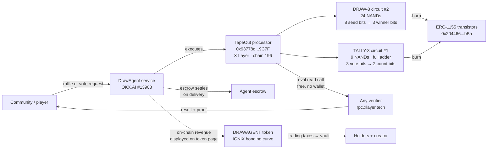

# DrawAgent — trustless draws on real on-chain circuits

**Live demo:** https://drawagent-demo.vercel.app ·
**Token:** [DRAWAGENT on IGNIX](https://ignix.bot/launch?token=0x40068a2987d9bB411e88b79731a9659eab18EEeE) `0x40068a2987d9bB411e88b79731a9659eab18EEeE` ·
**Hackathon:** TapeOut Genesis Transistor Hackathon (deadline Oct 6, 2026)

Raffles for 8 entrants and 3-ballot votes **executed by real NAND-gate circuits on X Layer** — not a randomness API, not a backend. Every result is a free `eval()` read call anyone can replay. Each execution burns transistors, tying demand to real usage.

## What / Why / How

- **What:** a casino-grade front end over two on-chain circuits — `DRAW-8` (circuit #2, 24 NANDs: 8 seed bits → 3 winner bits) and `TALLY-3` (circuit #1, 9 NANDs: 3 vote bits → 2 count bits) — plus an OKX.AI service agent (#13908) that runs draws for communities.
- **Why:** raffles and community votes today run on trust ("the mod drew a name in a hat / a bot picked"). DrawAgent makes the draw a **permanent on-chain function**: seed in, winner out, verifiable forever, no house that can cheat.
- **How:** the page fetches the latest X Layer block hash (seed = low byte), calls `eval(uint256 circuitId, bytes inputs)` on the TapeOut processor, decodes the little-endian output bits, and shows the exact call so anyone can re-run it. Win → confetti; the wheel and slot reels are pure theater — the chain is the dealer.

## Architecture



## TapeOut × X Layer integration

| Layer | What it does | Details |
|---|---|---|
| TapeOut | Physical-truth compute: flat NAND-only circuits, no sub-circuits on X Layer | `circuits.md` holds the canvas wiring recipes; `draw8.blif` / `tally3.blif` are the netlists; `draw8.svg` / `tally3.svg` schematics rendered by `schematic.py` |
| Processor contract | Holds both circuits, exposes `eval(uint256,bytes)` (selector `0x934d06ea`) | `0x93778d6D5a8372690564fED126ea8d0604929C7F` on X Layer (chain 196), [processor page](https://www.tapeout.net/#l2/xlayer/0x93778d6D5a8372690564fED126ea8d0604929C7F) · [explorer](https://www.oklink.com/x-layer/address/0x93778d6D5a8372690564fED126ea8d0604929C7F) |
| X Layer | Settlement + verification rail: `eth_getBlockByNumber` supplies the seed, `eth_call` replays any result for free | RPC `https://rpc.xlayer.tech` — no wallet needed to verify |
| Transistors (ERC-1155) | Usage meter: minted at ~0.00066 OKB, burned on every execution | `0x204466D4B547494A2e402647Ec8d473d4947DbBa` — 1,000,000 supply; **109 burned so far** (78 DRAW-8 + 31 TALLY-3) of documented real usage |
| OKX.AI agent | Distribution: service listing "Trustless raffle draws" (`service.json`) serves communities, escrow releases on sign-off | Agent ID 13908 (ASP, X Layer) |
| IGNIX / DRAWAGENT | Value capture: bonding-curve token on X Layer; trading taxes flow to the vault; agent on-chain revenue can be linked/displayed | [Launch page](https://ignix.bot/launch?token=0x40068a2987d9bB411e88b79731a9659eab18EEeE) |

### Verification (free read calls)

```
eval(uint256 circuitId, bytes inputs) → 0x934d06ea · I/O bits packed little-endian
DRAW-8: eval(2, 0x80) = 0x02 · eval(2, 0x01) = 0x01
TALLY-3: eval(1, 0x05) = 0x02   (ballots 101 → 2 Yes)
```

## Depth of TapeOut ecosystem integration

DrawAgent uses the full TapeOut production loop, not just its logo:

- **Canvas → simulate → tape out.** Both circuits were designed gate-by-gate on the TapeOut canvas (`circuits.md` wiring recipes), simulated locally with known vectors (S=0x01 → W=001; ballots 101 → count 2), then taped out — the transistor tokens consumed are genuinely burned, leaving permanent, immutable circuit NFTs nobody (including us) can alter.
- **Canonical gate economics.** TALLY-3 is 9 NANDs — exactly the textbook full adder (5 = half adder, 36 = 4-bit adder on the same scale). DRAW-8 is 24 NANDs of XOR-fold. Gate counts are the bill of materials, and the 109 burned transistors (78 + 31) are disclosed with per-circuit attribution — demand for draws *is* demand for transistors.
- **Reproducible artifacts in-repo.** `draw8.blif` / `tally3.blif` netlists, `draw8.svg` / `tally3.svg` schematics, and `schematic.py` (the renderer) mean any judge can rebuild the visuals from source. Nothing is screenshot-only.
- **Forward composability.** TapeOut circuits are reusable black boxes (REF): the roadmap's DRAW-16 and ranked-choice tally compose on top of #1/#2 instead of starting from raw NANDs — each new circuit burns more transistors and extends the same processor.
- **Permanent operation.** The circuits live as long as X Layer does — free, permissionless `eval()` for anyone, no gas, no API key, no backend that can be switched off. The demo page is a thin client; the chain is the dealer.

## Quality of X Layer integration

X Layer (chain 196) is the settlement, randomness, distribution, and value-capture rail — all four, natively:

- **Freshness from the chain itself.** Draw seeds come from the latest X Layer block hash (low byte) — no oracle, no off-chain RNG server, no commit-reveal round trips. Block production *is* the entropy source.
- **Zero-cost verification.** Every result replays as one `eth_call` against public RPC `https://rpc.xlayer.tech` — no wallet, no OKB, no indexer, no backend proxy. The page calls the chain directly from the browser.
- **Native distribution.** The DrawAgent service runs as OKX.AI agent #13908 (ASP, X Layer) with escrow settling each job on delivery — the agent economy and the execution chain are the same network.
- **Native value capture.** DRAWAGENT launched on IGNIX, X Layer's bonding-curve launchpad: fixed 16× curve, graduation to Uniswap with permanently locked liquidity, trading taxes routed to a vault split between creator and holders — with optional linking of the agent's on-chain revenue to the token page.
- **Native explorers.** Processor and token are inspectable on the X Layer explorer (OKLink) and the TapeOut processor page — two independent lenses on the same on-chain truth.

## Animation stack (why it looks like a casino)

Single static `index.html` — no build step, deploys anywhere. Open-source animation help:

- [`canvas-confetti`](https://github.com/catdad/canvas-confetti) (MIT, CDN) — win bursts, zero deps, canvas-based.
- Pure CSS/SVG roulette wheel — 8-segment SVG, `cubic-bezier(.12,.8,.08,1)` 3.4s spin, winner angle solved so the chain result lands under the pointer. Considered [`react-casino-roulette`](https://github.com/IvanAdmaers/react-casino-roulette), [`react-roulette-pro`](https://github.com/IvanAdmaers/react-roulette-pro), [`@theblindhawk/roulette`](https://github.com/TheBlindHawk/Roulette) — all React; rejected to keep the demo a single static file with no build.
- CSS slot reels (`slotblur` keyframes) for the tally suspense; marquee ticker, seat suspense-ticks, history feed — all vanilla JS.

## Repo map

```
index.html        casino front end (wheel, slots, verify, token links)
circuits.md       NAND wiring recipes for both circuits
draw8.blif / tally3.blif       netlists
draw8.svg / tally3.svg / *.png schematics
schematic.py      schematic renderer
service.json      OKX.AI service listing
submission.md     hackathon form fields + paste-ready description
avatar.png        agent avatar
```

## Vision / roadmap

- [x] Two circuits live on X Layer, 109 transistors of real burns
- [x] Live demo with one-click verification + DRAWAGENT token live on IGNIX
- [ ] Pilot draw with a real community (evidence: tx + video)
- [ ] 2-min demo video (live draw → on-chain verify)
- [ ] Escrow-settled agent jobs via OKX.AI (#13908) at volume
- [ ] More circuits: DRAW-16, ranked-choice tally, dice / loot-box tables
- [ ] Token utility: fee discounts for draws paid in DRAWAGENT, vault dividends to holders
- [ ] Submit form before **2026-10-06 11:00 (UTC+07:00)**

## Run it

```bash
# static — just open it, or:
python3 -m http.server -d . 8000
# deploy:
vercel deploy --prod
```
